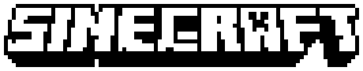

<div align="center">
    
</div>
<h2 align="center">A Minecraft clone that runs on Casio calculators!</h2>

> **This project is work-in-progress:** The game is not complete (I've started implementing crafting at the time of writing) and so it may be a while until something substantial is publicly available.

You heard me right: I'm developing a 3D block-based sandbox game that runs on a variety of Casio graphing calculators so that you have something to do when you're bored in class*. It'll be a very similar recreation of the classic Minecraft and early Minecraft PE days, on a device that seems to handle 3D rendering quite well.

Sinecraft _should_ be compatible with:
* Casio fx-9750GIII (my development calculator)
* Casio fx-9860GIII (practically the same thing)
* Casio fx-9750GII (such as [the calculator that runs a web server](https://github.com/Manawyrm/fxIP))**
* Casio fx-9860GII**
* Casio Graph 25+E/35+E/75+E (French equivalents)
* Casio Graph 35+USB/75/95** (French equivalents)

Colour calculator variants such as the Casio fx-CG50 and Casio Graph 90+E aren't supported yet since I don't own one to build Sinecraft for.

## Building
Sinecraft isn't in a remotely releaseable state, and so I'm not going to provide .g1a add-on files _just_ yet. Coming soon, though!

To build Sinecraft yourself, you'll need to install [fxSDK](https://gitea.planet-casio.com/Lephenixnoir/fxsdk), a versatile community-built software development kit that runs well on Linux systems. If you have it (and its dependencies) installed, simply run in the root directory:

```bash
$ fxsdk build-fx
```

You can then copy the `Sincft.g1a` file from the root directory to the root of the storage of your calculator over USB. Terminating the connection will then let you back onto your calculator's main menu, where you'll find Sinecraft at the bottom (you usually have to scroll down).

To update Sinecraft, simply copy the new version of `Sincft.g1a` over to the calculator, overwriting the old version. Your worlds should still be saved.

## Special thanks
Thanks to Lephenixnoir from [planet-casio.com](https://planet-casio.com) for building fxSDK, gint and many other libraries and tools that make developing Sinecraft possible.

Also, thanks to my friend Ben for contributing to the mathematical integrity of this project.

---

*Playing Sinecraft in a lesson is not recommended.

**Older-generation calculators may have lower-spec hardware, and so optimal gameplay may be limited.

Sinecraft is a community-made project and is not affiliated with Mojang Studios or Casio Computer Co., Ltd. Minecraft is a trademark of Mojang Studios.